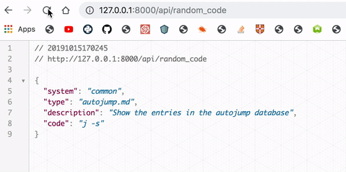

<p align="center">

    <p align="center">字字珠玑, 每日一记。</p>
        <p align="center">
    <a target="_blank" href="https://www.python.org/downloads/" title="Python version"></a>
    <a target="_blank" href="LICENSE" title="License: MIT"></a>
    <a target="_blank" href="FastAPI" title="FastAPI"></a></p>
</p>

> 利用cmd数量丰富的tldr库，生成一条随机命令的用法。

> en_doc [README_en.md](README_en.md)

## 环境依赖

- wkhtmltopdf
- requirements.txt所有

## 安装及使用

```sh
git clone https://github.com/s045pd/every_day_cmd.git

cd every_day_cmd

chmod +x run.sh && ./run.sh
```

然后访问 ```http://x.x.x.x:12308``` 他将根据你的user-agent来识别你的os并返回推荐命令。

并且我们提供 `\html` 及 `\png` 生成接口，具体怎么用就看你的啦




并且你可以指定系统，例如 `?os=linux,osx,common,window,sunos` 或者`?os=all` 来指定全部。


甚至于可以将其加入你的Github首页Readme

```md

### 🤡 Funny code you will learn


```


## 📝 License

This project is [MIT](https://github.com/kefranabg/readme-md-generator/blob/master/LICENSE) licensed.

***

如果您觉得这个脚本对您有用，可别忘了star哟🐶。